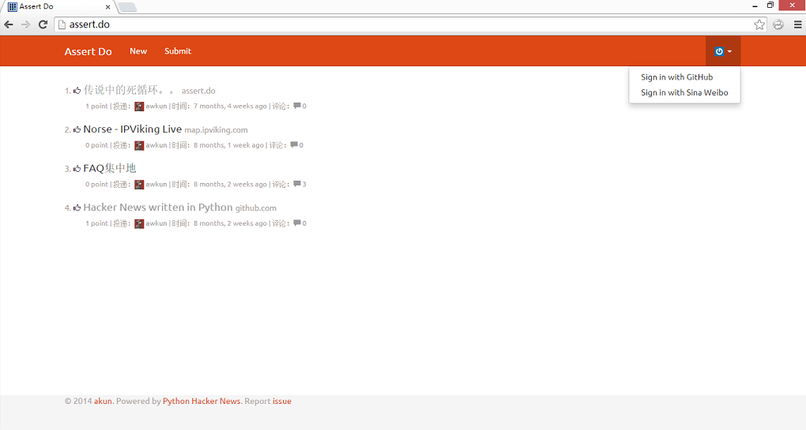

PyHackerNews
============

.. image:: https://travis-ci.org/akun/PyHackerNews.svg?branch=master
   :target: https://travis-ci.org/akun/PyHackerNews
   :alt: Build Status

.. image:: https://landscape.io/github/akun/PyHackerNews/master/landscape.png
   :target: https://landscape.io/github/akun/PyHackerNews/master
   :alt: Code Health

.. image:: https://coveralls.io/repos/akun/PyHackerNews/badge.png?branch=master
   :target: https://coveralls.io/r/akun/PyHackerNews?branch=master
   :alt: Coverage Status

Hacker News written in Python

Auto Install
------------

TODO

Manual Install
--------------

for example in Ubuntu 14.04 + MySQL + uWSGI + Nginx

Prepare
~~~~~~~

::

   sudo apt-get update
   sudo apt-get install git python-dev mysql-server libmysqlclient-dev nginx python-pip python-virtualenv
   sudo adduser --disabled-login --gecos 'PyHackerNews' pyhn

Config MySQL
~~~~~~~~~~~~

::

   sudo mysql_secure_installation

   sudo mysql -u root -p

   # !!!!replace @password as you wish!!!!
   mysql> CREATE USER 'pyhn'@'localhost' IDENTIFIED BY '@password';

   mysql> SET storage_engine=INNODB;
   mysql> CREATE DATABASE IF NOT EXISTS `pyhn_production` DEFAULT CHARACTER SET `utf8` COLLATE `utf8_unicode_ci`;
   mysql> GRANT SELECT, INSERT, UPDATE, DELETE, CREATE, DROP, INDEX, ALTER, LOCK TABLES ON `pyhn_production`.* TO 'pyhn'@'localhost';
   mysql> \q

   sudo -u pyhn -H mysql -u pyhn -p -D pyhn_production
   mysql> show databases;
   mysql> \q

Init Project
~~~~~~~~~~~~

::

   su pyhn
   cd /home/pyhn
   git clone https://github.com/akun/PyHackerNews.git
   cd /home/pyhn/PyHackerNews
   virtualenv venv
   source venv/bin/activate
   pip install -r requirements.txt
   cp src/pyhn/settings/local.example.py src/pyhn/settings/local.py
   vim src/pyhn/settings/local.py
   python src/manage.py syncdb --noinput
   python src/manage.py collectstatic --noinput

Config uWSGI
~~~~~~~~~~~~

::

   # you can also use default config
   vim deploy/uwsgi.ini

   # running it manually
   uwsgi deploy/uwsgi.ini

Config Nginx
~~~~~~~~~~~~

::

   # !!!!default port is 8000!!!!
   # you can change to 80, but need remove `/etc/nginx/sites-enabled/default`
   vim /home/pyhn/PyHackerNews/deploy/pyhn_nginx.conf

   exit  # use default user
   sudo ln -s /home/pyhn/PyHackerNews/deploy/pyhn_nginx.conf /etc/nginx/sites-enabled/
   sudo /etc/init.d/nginx restart

Config Upstart
~~~~~~~~~~~~~~

::

   # running uWSGI via Upstart
   sudo ln -s /home/pyhn/PyHackerNews/deploy/pyhn_uwsgi.conf /etc/init

   # after reboot, you can do it
   sudo initctl start|stop|restart pyhn_uwsgi

Done
~~~~

Demo: http://assert.do/

Features
--------

* [o] show news list

  + [o] show news list, order by score, with paginator
  + [o] show news list, order by post time
  + [o] show news info: title, domain, point, reporter, since when, comment count
  + [o] vote for news. **login required**
  + [o] remove news you post. **login required**

* [o] submit news

  + [o] submit news with title and URL/Content. **login required**

    - [o] URL for news
    - [o] leave URL blank to submit a question for discussion

* [o] comment

  + [o] show comment list order by score, with indent
  + [o] show comment info: comment words, point, who comment, since when
  + [o] copy comment link, in browser address input
  + [o] add comment abount news. **login required**
  + [o] reply the comment. **login required**
  + [o] vote for comment. **login required**
  + [o] remove the comment you add or reply. **login required**

* [o] Auth/Account

  + [o] login with social site's oauth

    - [o] GitHub
    - [o] Sina Webo

  + [o] show social site's oauth list
  + [o] edit personal account info: username, email(for gravatar). **login required**
  + [o] show someone account info: username for show, score, about

* [o] Hacker News Score System(auto)

  + [o] news score
  + [o] comment score
  + [o] user score
  + [o] calculate score in background

* [o] Customrize

  + [o] Title
  + [o] Copyright
  + [o] Google Analytics
  + [o] Bootstrap Themes

* [o] RSS

  + [o] in news
  + [ ] in user
  + [ ] in comment

Contributing
------------

fork it and init env

::

   $ git clone git@github.com:yourname/PyHackerNews.git
   $ cd PyHackerNews
   $ virtualenv .
   $ source bin/activate
   $ make

add features or resolve bugfix, then run test

::

   $ make test

make pull request

Changelog
---------

0.0.3
~~~~~

* support news RSS

0.0.2
~~~~~

* update Python requirements
* docs: Manual Install
* `make run` support run by `PORT`

0.0.1
~~~~~

* init project

License
-------

MIT
